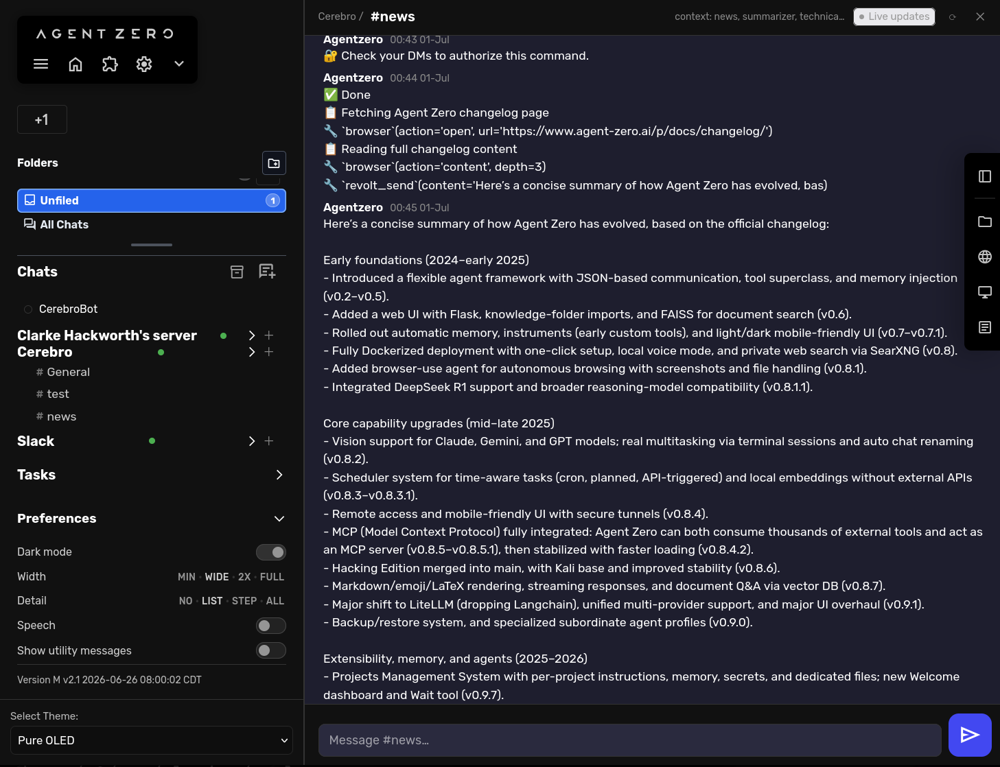
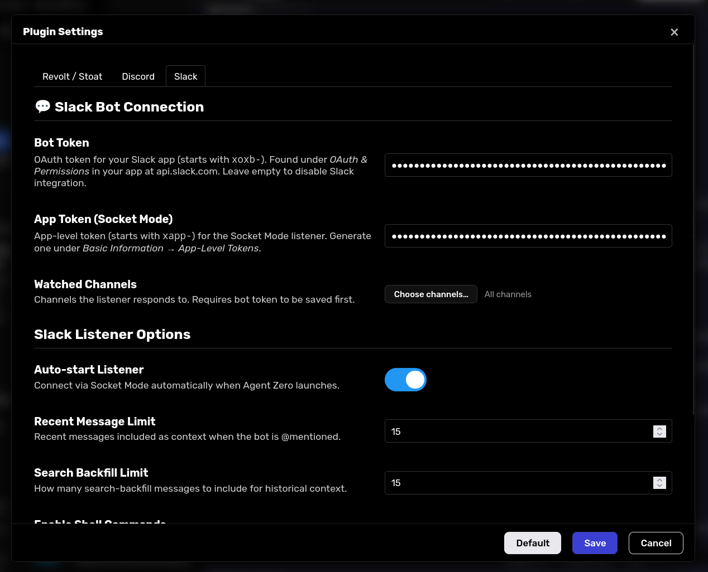

# AgentParley — Chat Plugin for Agent Zero

Bring [Agent Zero](https://github.com/frdel/agent-zero) into Stoat/Revolt, Discord, and Slack as a teammate, not a bolted-on bot. It listens for @mentions over WebSocket/Socket Mode, builds smart context-aware conversations from channel history, and replies right in-thread — without any browser or manual polling.



## Features

- **Three platforms, one agent** — Stoat/Revolt, Discord, and Slack all wired through the same listener and context-window pipeline
- **WebSocket / Socket Mode listener** — persistent background connection per platform; responds to @mentions automatically
- **Context-aware backfill** — combines recent messages, keyword-searched history, pinned messages, and neighbor expansion into a single rich context window
- **Shell command gating** — commands are disabled by default; when enabled, they can require a password confirmed via DM before running (see [Password security](#password-security))
- **DM password challenge** — if a password is set, the bot DMs the requester to confirm it out-of-band instead of trusting a password typed in a public channel
- **Three Agent Zero tools**
  - `parley_read` — fetch a channel's context window on demand
  - `parley_send` — post a message (auto-splits long replies)
  - `parley_channels` — list every channel in the server
- **Web UI config panel** — configure credentials and tuning knobs from the Agent Zero sidebar
- **Echo prevention** — the bot never triggers itself on its own messages

## Requirements

- A running [Agent Zero](https://github.com/frdel/agent-zero) instance
- At least one of: a self-hosted Revolt/Stoat instance, a Discord bot, or a Slack app

## Installation

### 1. Install the plugin

In Agent Zero's web UI, go to **Settings → Plugins → Add Plugin** and paste this repository's URL:

```
https://github.com/clarkehackworth/a0-agent-parley
```

Agent Zero clones the plugin and runs `execute.py` automatically to install its Python dependencies (`aiohttp`, `pyyaml`, `httptools`).

### 2. Configure credentials

Open Agent Zero's web UI → **Settings** → **Plugins** → **Parley**, and fill in the tab(s) for whichever platform(s) you're connecting.

**Stoat / Revolt**

| Field | Description |
|---|---|
| `REVOLT_URL` | Base URL of your Revolt instance, e.g. `http://stoat.lan:13080` |
| `REVOLT_BOT_TOKEN` | Token from your Revolt bot settings page |
| `REVOLT_BOT_ID` | The bot's user ID (filters the bot's own messages) |
| `REVOLT_SERVER_ID` | ID of the Revolt server (guild) to connect to |

**Discord**

| Field | Description |
|---|---|
| `DISCORD_BOT_TOKEN` | Bot token from the Discord Developer Portal |
| `DISCORD_GUILD_ID` | ID of the Discord guild (server) to connect to |
| `DISCORD_BOT_ID` | The bot's user ID (optional; auto-fetched via `/users/@me`) |

**Slack**

| Field | Description |
|---|---|
| `SLACK_BOT_TOKEN` | Bot token (`xoxb-...`) for Web API calls |
| `SLACK_APP_TOKEN` | App-level token (`xapp-...`) for the Socket Mode listener |
| `SLACK_TEAM_ID` | Slack workspace/team ID |

These can also be set as environment variables on the container.



## Bot setup per platform

Each platform needs a bot account created and invited before AgentParley can connect. Minimal steps and required permissions/scopes below.

### Stoat / Revolt

1. In your Revolt server, go to **Server Settings → Bots → Create Bot** and copy the generated **token** (`REVOLT_BOT_TOKEN`) and **bot user ID** (`REVOLT_BOT_ID`).
2. Invite the bot to your server via the bot's invite link, then note the server's ID (`REVOLT_SERVER_ID`, visible in **Server Settings → Overview**).
3. Give the bot's role permission to **View Channel**, **Send Messages**, and **Read Message History** in any channel it should watch.

### Discord

1. Create an application at the [Discord Developer Portal](https://discord.com/developers/applications) → **Bot** tab → **Add Bot**, then copy the **bot token** (`DISCORD_BOT_TOKEN`).
2. Under **Bot → Privileged Gateway Intents**, enable **Message Content Intent** — AgentParley requests the `GUILD_MESSAGES`, `MESSAGE_CONTENT`, and `DIRECT_MESSAGES` intents to read @mentions and DM replies.
3. Under **OAuth2 → URL Generator**, select the `bot` scope and grant **View Channels**, **Send Messages**, and **Read Message History**, then open the generated URL to invite the bot to your server (`DISCORD_GUILD_ID`).

### Slack

1. Create an app at [api.slack.com/apps](https://api.slack.com/apps) (from scratch), then under **OAuth & Permissions → Bot Token Scopes** add: `chat:write`, `channels:read`, `channels:history`, `groups:read`, `groups:history`, `im:read`, `im:history`, `users:read`. Add `search:read` too if you want keyword backfill.
2. Under **Socket Mode**, enable it and generate an **app-level token** with the `connections:write` scope (`SLACK_APP_TOKEN`).
3. Under **Event Subscriptions**, subscribe to the `message.channels` (and `message.im` for DMs) bot events, then **Install App to Workspace** and copy the **Bot User OAuth Token** (`SLACK_BOT_TOKEN`) and workspace **Team ID** (`SLACK_TEAM_ID`).
4. Invite the bot to any channels it should watch with `/invite @yourbot`.

### 3. Enable the plugin

In the Agent Zero sidebar, enable **Parley**. The WebSocket listener starts automatically (`auto_start: true` by default). The bot is now online.

## Configuration reference

All settings live in `default_config.yaml` and are overridable via env vars or the web UI.

| Key / Env var | Default | Description |
|---|---|---|
| `enable_commands` | `false` | Allow Agent Zero to run shell commands when triggered by a chat message |
| `commands_password` | _(empty)_ | If `enable_commands` is true and this is set, the requester must confirm this password via a DM challenge before commands run |
| `auto_start` / `REVOLT_AUTO_START` | `true` | Start listener automatically with Agent Zero |
| `watched_channels` / `REVOLT_WATCHED_CHANNELS` | _(empty = all)_ | Comma-separated channel IDs to respond to |
| `recent_limit` / `REVOLT_RECENT_LIMIT` | `25` | Recent messages to anchor the context window |
| `search_limit` / `REVOLT_SEARCH_LIMIT` | `15` | Keyword-backfill messages to include |
| `max_age_days` / `REVOLT_MAX_AGE_DAYS` | `30` | Drop backfill hits older than N days (0 = no limit) |
| `neighbors` / `REVOLT_NEIGHBORS` | `2` | Messages fetched either side of each backfill hit |
| `expand_top` / `REVOLT_EXPAND_TOP` | `3` | Top backfill hits to expand with neighbor messages |
| `include_first` / `REVOLT_INCLUDE_FIRST` | `true` | Include the channel's oldest message in every context |
| `include_pinned` / `REVOLT_INCLUDE_PINNED` | `true` | Include pinned messages in every context |

## Password security

If `enable_commands` is on and `commands_password` is set, the password is never accepted from the public channel message. Instead:

1. The requester @mentions the bot in the channel; the bot replies publicly with "🔐 Check your DMs to authorize this command."
2. The bot sends the requester a **direct message** asking them to reply with the password.
3. The requester replies to that DM with the password. Only that private reply is checked — the original public message is never inspected for a password.
4. If the correct password arrives within 2 minutes, the command is authorized and the original request proceeds. If it times out or the DM can't be sent (e.g. the requester has DMs disabled), the request is dropped and no commands run.

This means the password only ever needs to be known to a human confirming out-of-band — it's never parsed out of, or exposed in, the triggering channel message.

## Project layout

```
AgentParley/
├── plugin.yaml          # Plugin manifest (name, credentials, settings)
├── default_config.yaml  # Default values for all config knobs
├── hooks.py             # Agent Zero hook: reconnect on config save
├── initialize.py        # Dependency installer (aiohttp, pyyaml)
├── deploy.sh            # One-command deploy to Docker container
│
├── tools/               # Agent Zero tools
│   ├── parley_read.py
│   ├── parley_send.py
│   └── parley_channels.py
│
├── helpers/             # Shared runtime state
│   ├── revolt_listener.py   # WebSocket listener (background task)
│   ├── revolt_constants.py
│   └── revolt_sent_ids.py   # Echo prevention
│
├── core/                # Context window logic
│   ├── context_window.py
│   ├── context_config.py
│   ├── keywords.py
│   ├── formatting.py
│   └── message_split.py
│
├── infrastructure/      # Revolt API client
├── ports/               # Chat platform abstraction
├── webui/               # config.html panel
└── tests/
```

## Development

`deploy.sh` is a convenience script for pushing a local checkout straight into a dev container over SSH, without going through Agent Zero's plugin installer each time.

```bash
./deploy.sh
```

This copies the plugin into the container at `/a0/usr/plugins/parley/`, then runs `execute.py` to install Python dependencies inside the container's virtualenv. Add `--restart` to also bounce the container (needed if you changed listener startup logic or added new dependencies):

```bash
./deploy.sh --restart
```

> **Default target**: `docker -H ssh://docker.lan` / container `agent-zero`. Edit `deploy.sh` if your setup differs.
